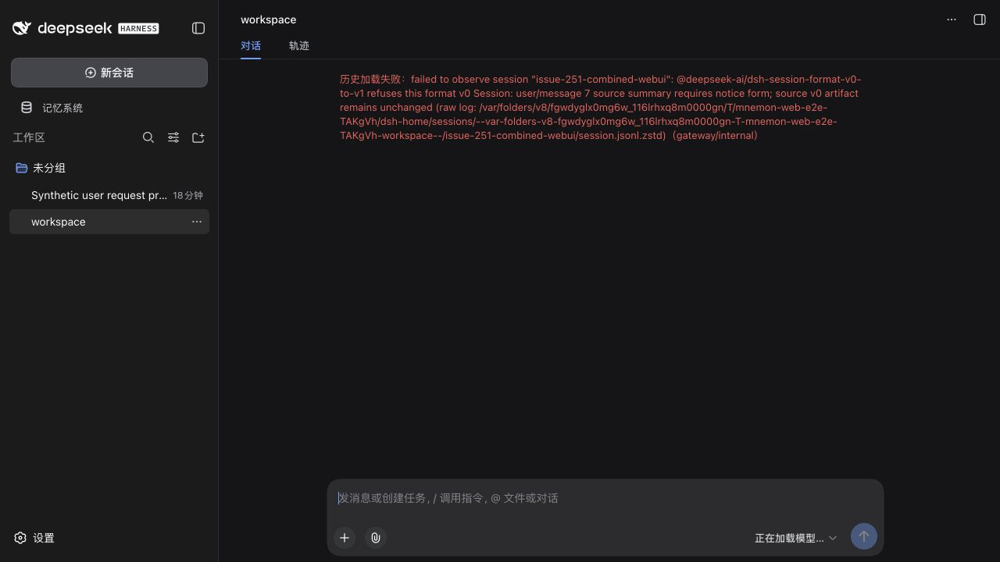
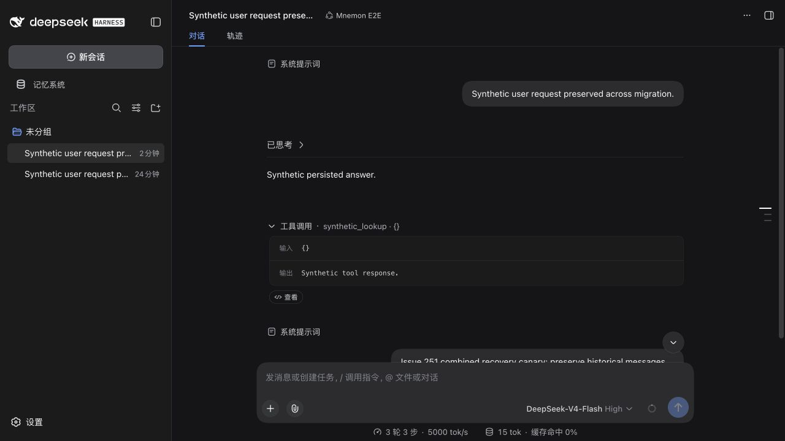
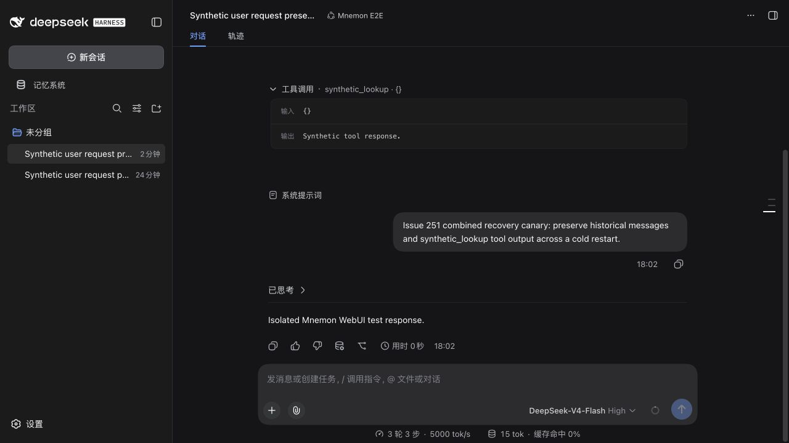

# Issue #251: explicit legacy Session recovery

[简体中文](./README.zh-CN.md) | [Issue #251](https://github.com/omdsh-dev/dsh-mnemon/issues/251) | [Recovery procedure](../../en/guides/operations.md#dsh-015-compatibility-and-legacy-session-recovery)

Reproduced from main `6ad99cc1890714355e1bb0e9230f3fce674bfb73` on 2026-09-14, using macOS arm64, Node 25.1.0, pnpm 11.19.0 and the published DSH 0.1.5-rc.1 packages. Only synthetic Session logs and disposable Profile, workspace and memory directories were used. The repair stays in the Starter's explicit maintenance CLI; it does not change Core/Source/Provider ownership, intercept history loading or modify DSH's frozen validator.

## Before and after in the actual WebUI

The [runtime fixture](../../../tests/fixtures/issue-251-legacy-v0.jsonl) extends the synthetic 0.1.2-produced history with the missing historical Runtime summary and an independent plugin's snapshot. Its session id, workspace, preset and model route were adapted to the disposable `scripts/serve-e2e.mjs` harness, then each line was encoded as a checksummed Zstandard frame.

The old CLI reported two repaired messages. Opening its copy in the actual WebUI still failed with `user/message 7 source summary requires notice form`: `Runtime memory snapshot` remained. Repository commit `000ecc1568899a794ecb5f8ccf6f28a90c13894e` confirms this exact summary was emitted as `dsh-mnemon` / `recall` by `memorySnapshotMessage()`.

The updated CLI reported three repairs. The original historical user request and assistant answer loaded. A new canary turn completed in the WebUI; after restarting the Host and reopening the Session, both turns remained readable. The selected configured model route used a loopback response server; no external model API was called. The original compressed backup SHA-256 remained `415d0a9470f9eb7301bcd02333d8be428b29082fe7b0ae74e43da43336022d3e`; the repaired copy was `2e69362ea5284683b933ef6b8f2e480486a723930a0fa262b657b80c63fa87e0`.

| Before: old repair leaves Runtime summary | After: resume, restart and cold reopen |
|---|---|
|  |  |

A second WebUI artifact uses the [combined fixture](../../../tests/fixtures/issue-251-repairable-v0.jsonl): all three summaries, a compatible v2 descriptor and a packed row with empty string ID/name. The old repair still failed at Runtime summary 7. The updated CLI reported three summary repairs, one descriptor promotion and one packed row expanded into three chunks, with no blockers. The actual DSH loader migrated the copy, and the UI displayed the historical user request, assistant answer and expanded `synthetic_lookup {}` call with `Synthetic tool response.` Selecting the configured loopback `DeepSeek-V4-Flash` route restored the interactive composer. The preserved original hash is `94f7da957d213c896c4794603580c9e982670bcd725ecffeee241eab3ad709e5`; the repaired copy is `07db52eaacf6d45fc2d4c0a2e8931604674ce332c3a0f823aeed4d4aacaeed3b`.

| Combined artifact before repair | After migration and tool-history rendering |
|---|---|
|  |  |

A canary turn also completed through the combined Session's actual WebUI. Cold reopening after a `SIGUSR2` Host restart retained the historical messages, expanded tool result and new exchange. The physical v3 log contained 43 rows. Structural comparison retained all five historical user/plugin messages apart from the three removed summary fields, both historical assistant messages, the durable tool call/result and the expanded stream. The original and repaired v0 hashes remained unchanged; external model calls remained zero.

| Historical messages and tool output after cold reopen | Canary exchange retained after cold reopen |
|---|---|
|  |  |

The shared Starter baseline also loaded all three optional strategy extensions and reported the installed Native CLI 0.2.8. A separate disposable real-CLI create/write/keyword-recall/forget smoke passed. [Native status screenshot](./baseline-native-status.jpg). These checks do not imply that this patch changes Native storage.

## Audited transformations and boundaries

| Shape | Verified behavior |
|---|---|
| Three historical Mnemon summaries | Remove only the recognized summary members; preserve bodies and other plugin sources. |
| Compatible descriptor v2 | Change only version 2 to 3 after checking the exact historical keys and every applicable frozen v3 constraint. |
| Packed tool deltas with empty string ID or name | Expand to their exact raw delta events, preserving logical sequence, timing, names and arguments. |
| Already raw empty string deltas | Keep byte-identical; the actual released migration supports them. |
| Null names, empty completed/durable call identities, incompatible descriptors or unsafe packed rows | Report bounded line/event/path diagnostics, exit 1 and publish no output. |

Descriptor v2 was found in published `dsh-subagent@0.1.1-rc.2`; the audited `0.1.2-alpha.2` and `0.1.2-rc.1` artifacts already use v3. Comparing `lib/types/descriptor.js` and the cold-resume code in `continuation.js` shows v3 adds optional `agentReasoningEffort`. Leaving that absent preserves the old declared composition. One-shot records permit only version/mode/provider and optional label. Continuable records permit label, a paired agentProvider/agentModel, persona and closed allow/deny tool filters. No field is trimmed, synthesized or discarded. Runtime defaults across different DSH releases are outside this equivalence claim.

Historical `dsh-session@0.1.2-rc.1/lib/types/chunk-rows.js` accepts string placeholders and defines their exact expansion. The current physical decoder rejects packed empty IDs. Packed empty names can pass migration but then fail `expandAssistantStream`. In contrast, the actual v0→v3 path preserves raw empty-string deltas through `AssistantStreamAccumulator`. Tests therefore validate complete migration **and timed stream replay**, not just the exported standalone payload validator.

Dropping deltas would lose timestamps, arguments and provenance. Replacing null names can alter first-token timing. Inventing a durable call ID cannot recover the original identity passed to provider replay, tool execution, hooks, PTC subcalls and external spill files. Even a unique local call/result pairing does not prove those external references. Those variants require a sanitized artifact and recovery knowledge from their original writer; this change does not claim every shape in #251 is recoverable.

The published v0→v1 migration `lib/index.js` is byte-identical in 0.1.5-rc.1 and 0.1.5-rc.2 (SHA-256 `15ae26b90310d83b1b90a5e7cad9e2f34282fddaba2f19f2fd2232382065603d`). Full execution here uses rc.1. No published `dsh@0.1.2-rc.2` was found in the registry; the reported source build cannot be identified without its commit.

## Regression and reproduction

[Repair tests](../../../tests/legacy-session-repair.spec.ts) exercise published JSONL persistence, v3 publication, cold reopen and exact timed stream expansion; strict descriptor gates; all supported repairs together; unrelated plugin preservation; raw and compressed idempotence; exclusive output creation; diagnostics and refusal; duplicate fields, malformed frames, unsafe coordinates and expanded-size limits. The [combined fixture](../../../tests/fixtures/issue-251-repairable-v0.jsonl) contains all supported repairs. [Machine-readable evidence](./verification.json).

Final suites: 1,028 root tests and 323 independent plugin tests passed; seven opt-in tests were skipped. The repair suite has 66 cases. `pnpm verify` passed; after the final legacy diagnostic adjustment, types, the complete root suite and package checks passed again. Deterministic builds, docs, public entries, publint/attw and real Headless activation passed. The maintenance executable increases the measured package to 1,288,712 unpacked bytes; its guard is now 1,292,000 bytes. The Host and Client bundles retain their existing code. Independent review also checked 144 descriptor combinations and 125 packed coordinate boundaries against BigInt.

```sh
pnpm install --frozen-lockfile
pnpm exec vitest run tests/legacy-session-repair.spec.ts tests/lifecycle.spec.ts
pnpm run verify
node bin/repair-legacy-session.mjs --input tests/fixtures/issue-251-repairable-v0.jsonl
MNEMON_CLI_PATH=/absolute/path/to/mnemon pnpm e2e:serve --strategy-extensions
```

The WebUI screenshots cover Runtime summary recovery and the combined summary/descriptor/packed-string artifact. Exact timed delta preservation is additionally verified by the published loader and stream replay tests. No Windows source build, live third-party Provider or production Session was tested.
